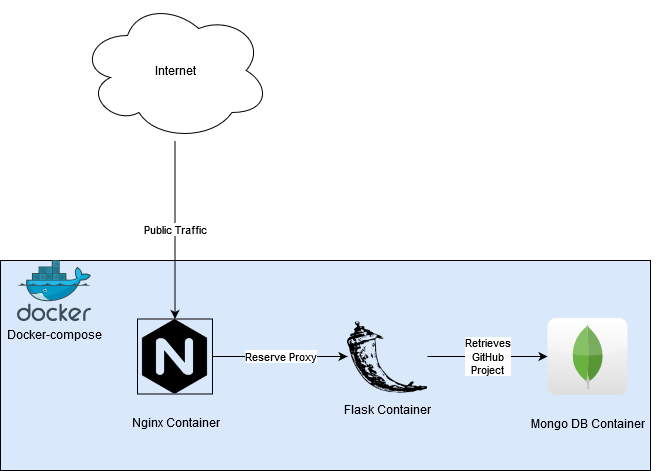

# Portfolio Site
The project contains the code used to the alexmarriott.work portfolio site.

The site uses the following technology stack:

* Docker-compose
  * Python3 flask container
  * Mongo DB container
  * Nginx container (reserve proxy for flask container)
  * Github API (PyGitHub library) to pull project READMEs

The project is linked to a TravisCI  job which auto deploys the code to a remote server and deploys
the docker-compose.

## Docker-Compose
 

## View project
[See the wikisite project on github!](https://github.com/AlexMarriott/portfolio-site)
